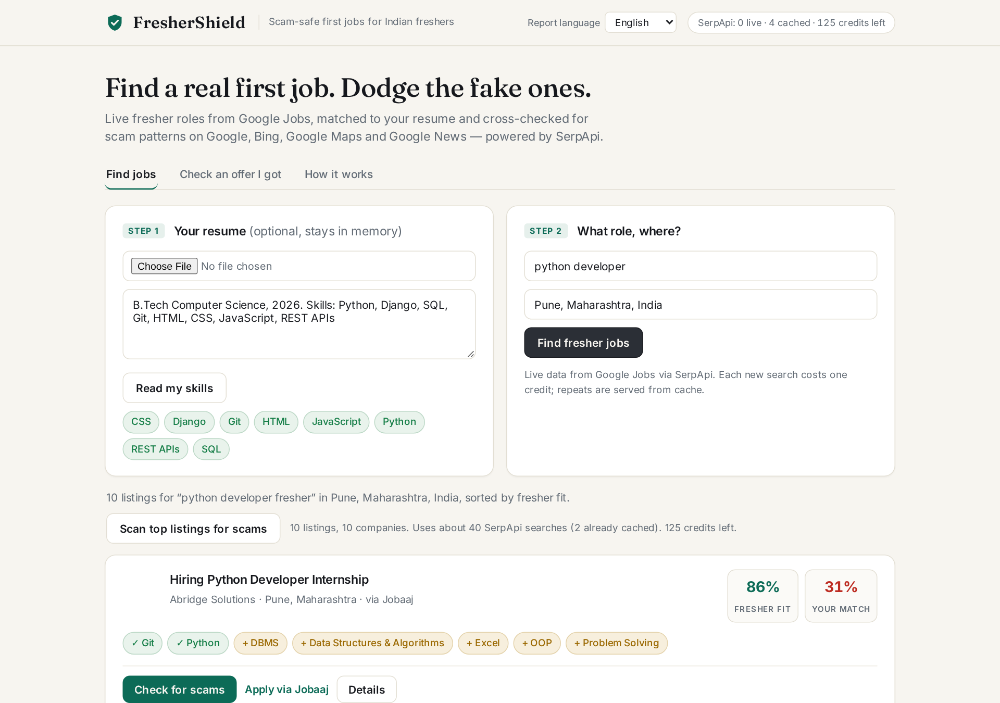
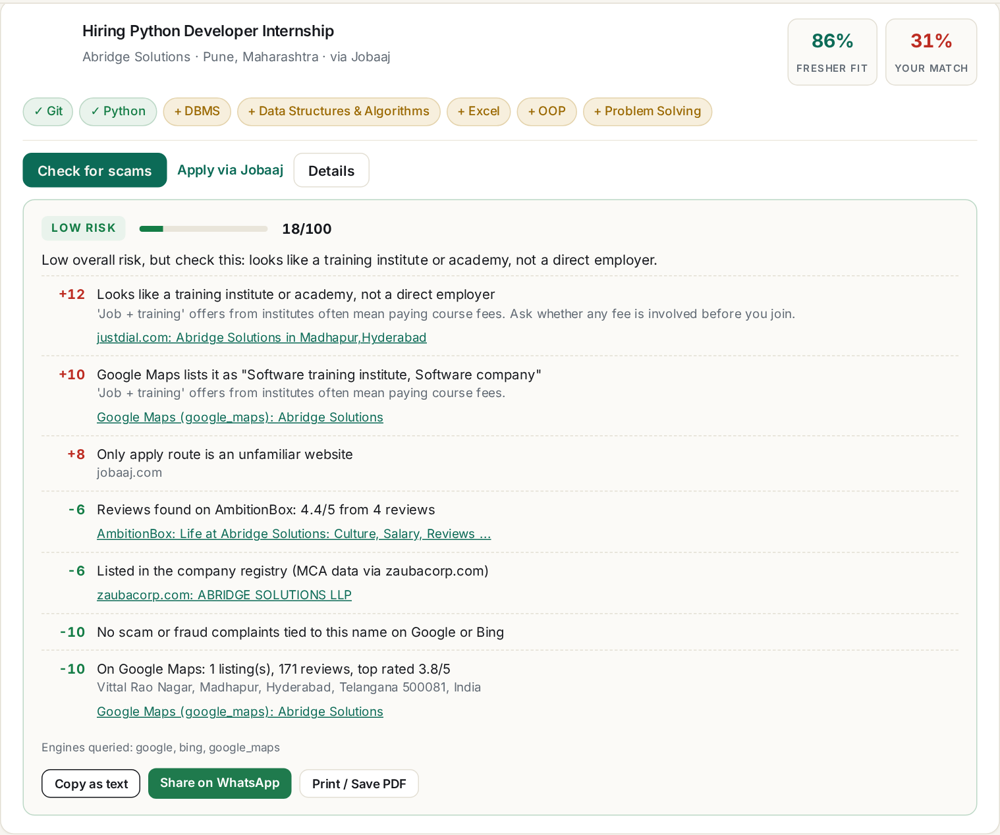
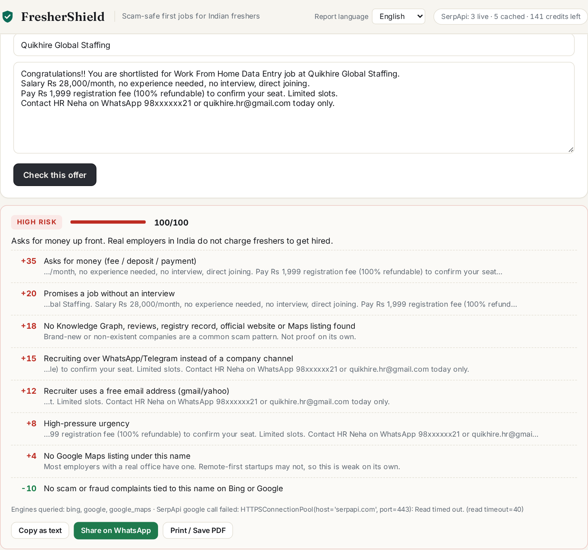
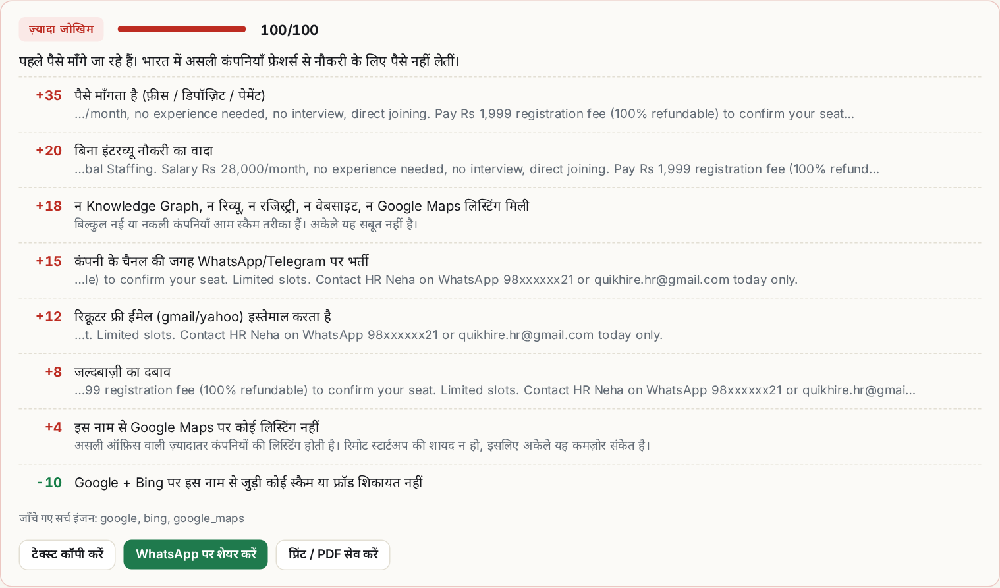

# FresherShield

[](https://github.com/akashrajeev/FresherShield/actions/workflows/tests.yml)

**A scam-safe first-job copilot for freshers in India.**

Every year lakhs of graduates in India look for their first job, and fake job
offers target exactly them: a "registration fee", a WhatsApp recruiter, an offer
letter with a real company's logo. FresherShield helps a fresher find real
entry-level roles, see how well they fit, and check whether a posting or an offer
looks like a scam, with the evidence shown instead of a black-box score.

Built for the **SerpApi India Hackathon 2026**, track **Knowledge & Public Interest**.

**Demo video (1:33, running locally):** https://youtu.be/PF9-dIF4Va0

## Screenshots

| Fresher jobs from Google Jobs, matched to your resume | Scam report on a live listing |
|---|---|
|  |  |

| A pasted WhatsApp fee-scam offer | The same report in Hindi |
|---|---|
|  |  |

Malayalam: [docs/screenshots/offer-report-ml.png](docs/screenshots/offer-report-ml.png) ·
print / save-as-PDF view: [docs/screenshots/print-hi.png](docs/screenshots/print-hi.png).
Full request/response walkthroughs: **[docs/EXAMPLES.md](docs/EXAMPLES.md)**.

## What it does

1. **Find fresher jobs** - live listings from Google Jobs for a role and city,
   ranked by how open they are to people with no experience ("freshers", "0-1 years",
   "2026 batch" push a job up; "5+ years", "senior" push it down).
2. **Match your resume** - upload a PDF or paste text. FresherShield pulls out your
   skills and shows, for each job, which required skills you have and which you're
   missing. The resume stays in memory and is never written to disk.
3. **Check for scams** - one click per listing:
   - red flags in the posting itself (fees/deposits, WhatsApp-only contact, gmail
     recruiters, "no interview" promises, earn-per-day typing jobs, unrealistic pay);
   - a cross-engine check of the company name on **Google and Bing** for scam, fraud
     and complaint results;
   - a legitimacy check: Google Knowledge Graph entry, employee reviews, official site;
   - a **Google Maps** check: does the company have real offices with reviews, and is
     it actually a placement agency or training institute rather than an employer?
4. **Check an offer I got** - paste a WhatsApp/Telegram/email offer and the company
   name, and get the same report.
5. **Show it to someone before paying** - switch the report to **Hindi or Malayalam**,
   copy it as plain text, share it on WhatsApp, or print / save it as a one-page PDF with
   the evidence links spelled out. Fake offers arrive on WhatsApp, often in Hindi or a
   regional language, and the people a fresher asks first (parents, friends) may not read
   English.

Big brands whose names are used on fake offer letters are flagged as
**impersonation risk** ("apply only through the official careers page"), not as scams.

The full scoring rules are in [docs/METHODOLOGY.md](docs/METHODOLOGY.md).

## SerpApi APIs used, and why

| API | `engine` | Used for | Why it matters |
|---|---|---|---|
| [Google Jobs API](https://serpapi.com/google-jobs-api) | `google_jobs` | Fresher job discovery (title, company, location, description, highlights, salary, apply options, pagination via `next_page_token`) | Google Jobs aggregates LinkedIn, Naukri, Indeed, company career pages and more in one structured feed. The apply options also tell us *where* a job can be applied to, which is itself a scam signal. |
| [Google Search API](https://serpapi.com/search-api) | `google` | (a) complaint search `"<company>" scam OR fraud OR fake OR complaint`; (b) legitimacy search for `knowledge_graph`, review rich snippets and the official site | Complaint forums, Reddit threads and company fraud-alert pages are where scam evidence lives. The Knowledge Graph and review snippets are strong signals that a company is real. |
| [Bing Search API](https://serpapi.com/bing-search-api) | `bing` | Same complaint query, `cc=IN` | A second, independent index. Scam reports are thin and noisy; the same complaint page appearing on two engines is much stronger evidence than one. |
| [Google Maps API](https://serpapi.com/google-maps-api) | `google_maps` | Company-name search across India (`type=search`): matching places, review counts, ratings, category | Real employers have offices people have reviewed; fee-scam "companies" usually don't exist on a map. The category catches "companies" that are really placement agencies or training institutes. |
| [Account API](https://serpapi.com/account-api) | - | Remaining-credits meter in the header | Free call; keeps the free-tier budget visible. |

Every feature except resume parsing runs on SerpApi data. A full scam check costs 4
searches per company (Google x2, Bing, Google Maps). The official [`serpapi` Python client](https://github.com/serpapi/serpapi-python) is used for all calls.

### Staying inside the free tier

- All responses are cached in a local SQLite file (`.cache/serp.sqlite`, 7-day TTL by
  default), so repeating a search or re-checking a company costs nothing.
- Scam checks run only when you click, never automatically for every listing.
- The header shows live calls vs cache hits for the session and credits left.
- `FS_OFFLINE=1` runs entirely from the cache (useful for demos and tests).

## Run it locally

Requires Python 3.10+.

```bash
git clone https://github.com/akashrajeev/FresherShield.git
cd FresherShield
python -m venv .venv && source .venv/bin/activate   # Windows: .venv\Scripts\activate
pip install -r requirements.txt
cp .env.example .env        # then put your key in SERPAPI_API_KEY
python -m app.main          # or: uvicorn app.main:app --reload
```

Open <http://127.0.0.1:8000>. Get a free SerpApi key (250 searches/month) at
<https://serpapi.com/manage-api-key>.

### Tests

```bash
pip install -r requirements-dev.txt
pytest
```

The tests use small hand-written SerpApi-shaped payloads, so they need no key and
spend no credits.

## API

| Method | Path | Body / params | Returns |
|---|---|---|---|
| GET | `/api/jobs` | `role`, `location`, `pages` (1-3) | fresher-ranked jobs with match and quick flags |
| POST | `/api/resume` | multipart `file` (PDF/TXT) or `text` | detected skills |
| POST | `/api/check` | `{job_id}` or `{company, offer_text}`, optional `lang` (`en`/`hi`/`ml`) | risk report with signals, evidence and `share_text` |
| POST | `/api/check-batch` | `{job_ids: [...]}` (max 10), optional `lang` | reports keyed by job id |
| GET | `/api/langs` | - | report languages |
| GET | `/api/status` | - | key present, offline mode, session call stats, credits left |

## Project layout

```
app/
  serp.py      SerpApi client: SQLite cache, offline mode, call ledger
  jobs.py      Google Jobs search, normalization, fresher-fit scoring
  resume.py    skill taxonomy, PDF text extraction, explainable match
  scam.py      posting red flags + Google/Bing/Maps footprint -> risk report
  i18n.py      Hindi/Malayalam report strings + plain-text export
  main.py      FastAPI routes
  static/      single-page UI (plain HTML/CSS/JS, no build step)
docs/METHODOLOGY.md   how the risk score works, weights, limits
docs/EXAMPLES.md      two worked end-to-end checks with real output
docs/screenshots/     README images (rebuild: python demo/screenshots.py)
tests/                unit tests (no network), run by GitHub Actions on every push
```

## Limits

FresherShield is a triage tool. A "low risk" result is not a guarantee and a "high
risk" result is not an accusation; it tells you what to verify. See the known limits
in [docs/METHODOLOGY.md](docs/METHODOLOGY.md#known-limits). If you've been targeted,
report it at <https://cybercrime.gov.in> or call **1930**.

## AI tools used

This project was built with help from an AI assistant (Instinct, an AI agent
platform). It was used to write and refactor code, write the tests and draft the
documentation, working from the author's concept and review. The scam-signal rules
and weights are hand-written and deterministic; the app itself makes no LLM calls.
The Hindi and Malayalam report strings (`app/i18n.py`) were drafted with the AI
assistant; corrections from native speakers are welcome.
The demo video's voiceover is AI text-to-speech, read from a script written for
the demo (`demo/vo/`); `demo/record_demo.py` + `demo/mix_voiceover.sh` rebuild it.

## Hackathon notes

- Track: Knowledge & Public Interest
- New project, started during the hackathon (September 2026).

## License

MIT - see [LICENSE](LICENSE).
